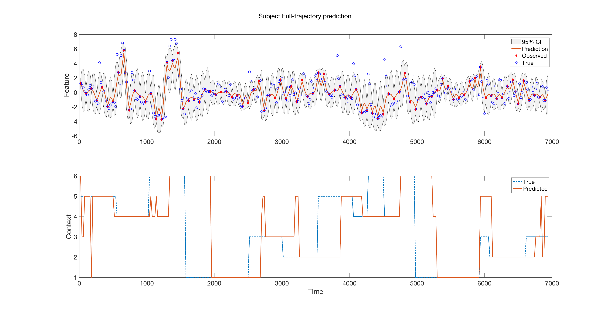
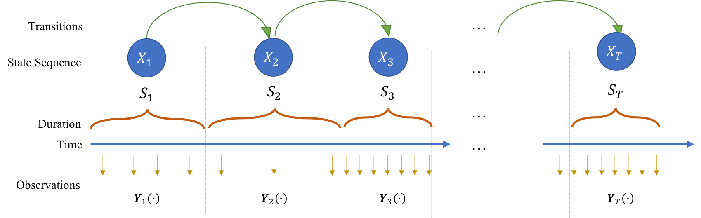
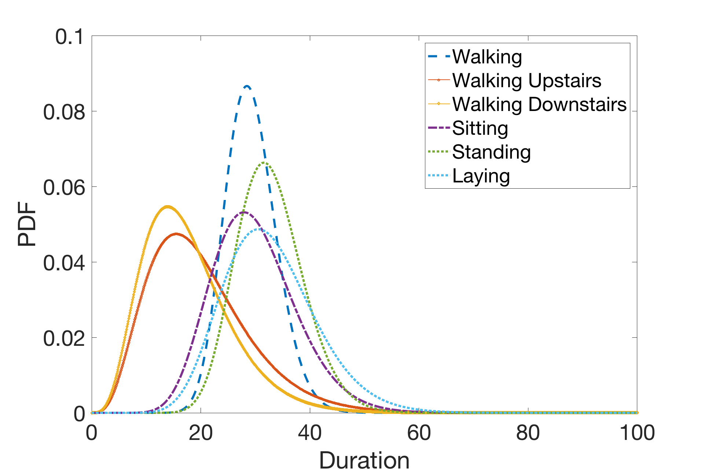

# SwitchingGP

["Adaptive activity monitoring with uncertainty quantification in switching Gaussian process models"](http://proceedings.mlr.press/v89/ardywibowo19a.html)

Randy Ardywibowo, Guang Zhao, Zhangyang Wang, Bobak Mortazavi, Shuai Huang, and Xiaoning Qian

<p align="center">
  </br>
  <span align="center">Our predictions on the UCI HAR dataset</span>
</p>

</br>


## Usage

### Train the Switching Gaussian Process model

Train the switching GP model by running 

```Methods/runPopMTGP.m```

You can experiment with different kernels and training methods by running 

```Methods/runPopMTGP_joint_contexts.m```

This runs the Baseline + Separate time dependence + Separate Multivariate model. The other file,

```Methods/runPopMTGP_joint.m```

runs the Baseline + Separate time dependence + Combined Multivariate model.

### Prediction using the Switching Gaussian Process model

To predict, run

```PopMTGPpredict_popmtgp_all_tasks.m```

## Citation
Please consider citing our paper if you find the software useful for your work.

```
@inproceedings{ardywibowo2019adaptive,
  title={Adaptive activity monitoring with uncertainty quantification in switching Gaussian process models},
  author={Ardywibowo, Randy and Zhao, Guang and Wang, Zhangyang and Mortazavi, Bobak and Huang, Shuai and Qian, Xiaoning},
  booktitle={The 22nd International Conference on Artificial Intelligence and Statistics},
  pages={266--275},
  year={2019},
  organization={PMLR}
}
```
